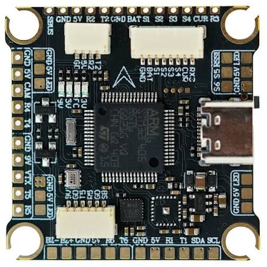

# Drone Wiring

Here is how the drone is currently wired up without the GPS:

### Power & Motors
* **Battery:** 3S LiPo plugs into the ESC power distributor (PDB).
* **ESCs:** All 4 ESCs get power from the distributor, and each connects to its BLDC motor.
* **Flight Controller Power:** Spliced directly from the battery/distributor to **BAT** and **GND** on the F405.

### Signals & Ground
* **ESC Signals:** ESC signal wires connect to **S1**, **S2**, **S3**, and **S4** respectively on the top row of the FC.
* **ESC Ground:** All 4 ESC ground wires are tied together and soldered to a single **GND** pad in that same top row.
* **BEC Power:** Cut/disconnected the +5V red wire on all ESCs so they don't mess with the FC's regulator.

### Receiver (FlySky FS-iA6B)
Connected via i-BUS to the top row:
* **5V** -> 5V pad
* **GND** -> GND pad
* **Signal** -> **R2** (UART2 RX)
