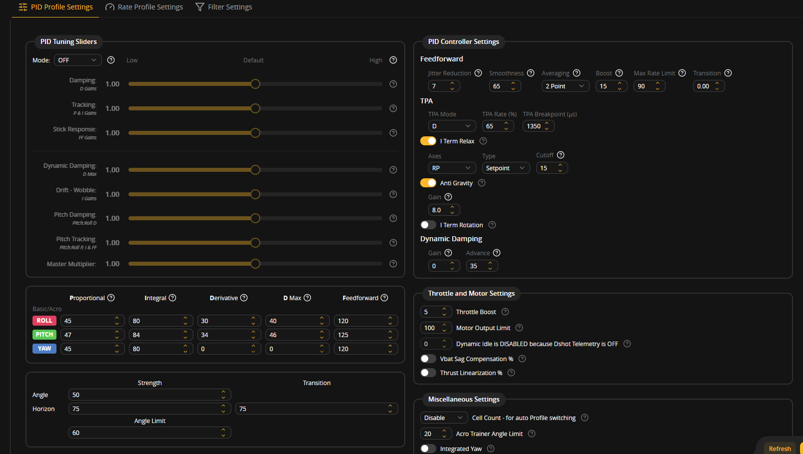

# Test 01: Hardware Check & Motor Commutation (Strapped)

**Date:** October 3, 2026  
**Status:** Completed & Passed (Hardware 100% Functional; PIDs Require 500mm Tuning)  
**Setup:** Fully Strapped to Suitcase Anchor Testbed  

---

## 🎯 Test Objective & Scope
* **Primary Goal:** Verify arming sequence, motor startup synchronization, and live commutation under battery power after the recent ESC replacement on Motor 4.
* **Method:** Live tethered run with the drone strapped down tightly to the suitcase testbed platform. No untethered flight was attempted to ensure 100% safety during hardware verification.
* **Whiteboard Briefing:**
  * **Goal:** Arming & Motor Check
  * **Description:** Hardware check while strapped

---

## 🛠️ Hardware Stack (Bench Configuration)
As recorded on the test whiteboard:

| Component | Specification | Notes |
| :--- | :--- | :--- |
| **Frame** | TBS 500 (Clone) | 500mm diagonal wheelbase |
| **Flight Controller** | DakeFPV F405 | STM32F405 running target `DAKEFPVF405` |
| **ESCs** | 4x 30A Analog | SimonK / BLHeli; +5V BEC wires clipped/disconnected to isolate FC power |
| **Motors** | 4x 2212 1000KV | Sensorless brushless outrunners |
| **Battery** | 3S 2200mAh LiPo | Direct XT60 connection |
| **Radio Link** | FlySky FS-i6 TX / FS-iA6B RX | Serial i-BUS protocol on UART2 |
| **Propellers** | 10-inch (1045) | Standard pitch quad-X configuration |
| **GPS / Compass** | None | Disabled for lean bench testing |

---

## ⚙️ Firmware & Tuning Profile
* **Firmware:** Betaflight 4.4+
* **Tuning Profile:** Stock Default 5-inch Miniquad Preset

### Stock PID Controller Values
* **Roll:** P: `45` | I: `80` | D: `30` | D Max: `40` | Feedforward: `120`
* **Pitch:** P: `47` | I: `84` | D: `34` | D Max: `46` | Feedforward: `125`
* **Yaw:** P: `45` | I: `80` | D: `0` | D Max: `0` | Feedforward: `120`
* **Master Multiplier:** `1.00`
* **Feedforward Settings:** Jitter Reduction: `7`, Smoothness: `65`, Averaging: `2 Point`, Boost: `15`, Max Rate Limit: `90`
* **Anti-Gravity:** Enabled (Gain: `8.0`)
* **TPA:** Mode `D`, Rate `65%`, Breakpoint `1350µs`

---

## 📹 Video Recording & Analysis
* **Video File:** [Test 01 Video Recording](test_01_hardware_check_strapped.mp4)

### Video Walkthrough & Observations
1. **Anchor Platform Rig:**
   * The 500mm quad is securely strapped flat to the suitcase anchor base using heavy-duty nylon tethers and weights, completely preventing propeller strike hazards.
2. **Arming Sequence:**
   * Operator powers the FlySky FS-i6 transmitter and toggles the dedicated arm switch (AUX 1).
   * All four motors wake up and spin up simultaneously into smooth idle without hesitation, stutter, or synchronization lag.
3. **Motor 4 ESC Validation:**
   * Motor 4 spins freely and cleanly in full synchronization with Motors 1–3, proving that the previous shorted MOSFET and electromagnetic drag issue is completely resolved.
4. **Throttle Ramp & Commutation:**
   * Operator gently advances the throttle. The acoustic profile is crisp and uniform across all four quadrants with healthy commutation.
5. **Attitude Command Check:**
   * Small roll and pitch stick inputs were pulsed to confirm directional differential thrust. The motors modulated thrust correctly in response to transmitter commands.
6. **PID Aggression on Large Frame:**
   * **Observation:** The control loop exhibits noticeable aggression and motor RPM hunting when throttled up.
   * **Root Cause:** Stock Betaflight PIDs are tuned for lightweight (~600g–700g) 5-inch miniquads with high-KV motors and very low rotational inertia. A 500mm frame swinging heavy 10-inch props has significantly higher angular inertia. When strapped down, the gyro detects no angular rate change despite high motor output, causing the stock P and D terms to wind up aggressively.
7. **Disarm & Safety:**
   * The operator toggled the disarm switch; all motors stopped instantaneously. Failsafe and disarm responsiveness were 100% verified.
   * Session ended with an affirmative thumbs-up from the operator.

---

## 📋 Outcomes & Next Steps
* [x] **Motor Commutation:** PASSED — all 4 motors spin cleanly and synchronously.
* [x] **Motor 4 ESC Replacement:** PASSED — zero drag, normal temperatures.
* [x] **Radio Link & Failsafe:** PASSED — reliable i-BUS link and instant disarm.
* [ ] **PID Calibration for 500mm Frame:** PENDING — apply custom low-gain PID multipliers (`p_gain_multiplier = 50`, `d_gain_multiplier = 50`, `feedforward_multiplier = 0`, `gyro_filter_multiplier = 80`) from `cli_dump.txt` to eliminate aggression before tethered hover tests.
