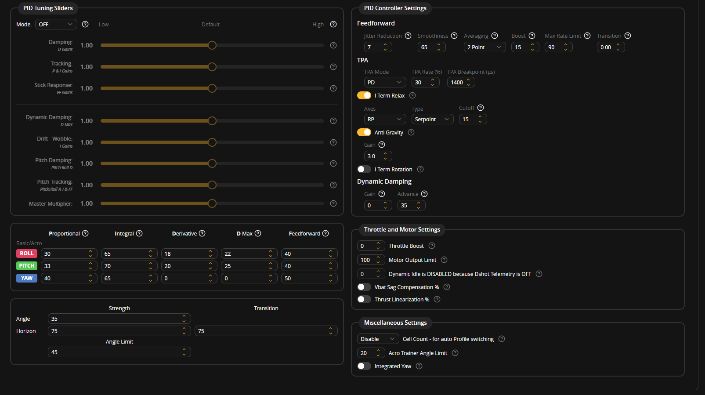

# Test 02: First Untethered Takeoff Attempt (Custom PIDs)

**Date:** October 3, 2026  
**Result:** Aborted / Failed (Extreme wobble on takeoff, cut throttle and disarmed for safety)  
**Setup:** Untethered on tiled floor  

---

## Why I Did This Test
After Test 01 proved that the hardware was fully working and confirmed that stock 5-inch Betaflight PIDs were way too aggressive, I loaded up a custom low-gain PID profile. The goal for Test 02 was simple: see if we could achieve a smooth, stable liftoff and brief hover. 

Instead of keeping it strapped down, I decided to test it free on the floor. In hindsight, I definitely should have kept it on the tether rig, but I wanted to see how the quad handled ground effect and liftoff on its own.

---

## The Whiteboard Breakdown
Here is the whiteboard setup for this run:

* **Goal:** Achieve Stable Flight
* **Description:** Tuning refined for Big Frame
* **Hardware Stack:**
  * Frame: TBS 500 (Clone)
  * FC: DakeFPV F405
  * ESCs: 30A Analog (SimonK/BLHeli, isolated 5V)
  * Motors: 4x 2212 1000KV (1045 props)
  * Battery: 3S 2200mAh LiPo
  * Radio: FlySky FS-i6 TX / FS-iA6B RX (i-BUS)
  * GPS: None
* **Firmware:** Betaflight
* **Tuning:** Custom

---

## The Custom Tuning Profile I Used

I dialed back the gains across the board to calm down the aggression we saw in Test 01:

### Key Changes from Stock:
* **Roll:** P dropped from 45 to 30, I from 80 to 65, D from 30 to 18, D Max to 22, Feedforward from 120 down to 40.
* **Pitch:** P dropped from 47 to 33, I from 84 to 70, D from 34 to 20, D Max to 25, Feedforward from 125 down to 40.
* **Yaw:** P dropped to 40, I to 65, Feedforward to 50.
* **Angle Mode:** Lowered angle strength from 50 down to 35, and reduced angle limit from 60 to 45 degrees.
* **Anti-Gravity:** Lowered gain from 8.0 down to 3.0.
* **Throttle Boost:** Disabled completely (dropped from 5 to 0).
* **TPA:** Switched to PD mode with a 30% reduction rate starting at 1400us.

---

## What Happened in the Test Video

You can watch the recording of the attempt here: [Test 02 Video Recording](test_02_takeoff_wobble_abort.mp4)

Here is what went down during the test:

1. **Attempt 1 (Slide on Tile):** I armed the quad and gently gave it throttle. Because the floor is smooth tile, the prop wash made the quad slide backwards and to the right before it had enough lift. I disarmed, walked over, and set it back square in the middle of the room.
2. **Attempt 2 (The Takeoff Attempt):** I stepped back, armed again, and started steadily raising the throttle to lift off cleanly.
3. **The Wobble:** Right as the quad became light on its skids and the props started biting into the air, the entire frame broke into an extreme, violent rocking wobble across both the roll and pitch axes.
4. **The Abort:** The oscillation fed into itself within a split second, causing the drone to pitch hard, hop sideways, and tip over on its arm with prop chatter against the floor.
5. **Immediate Disarm:** I immediately killed the throttle and slapped the disarm switch to prevent burning out an ESC or snapping a motor shaft. Luckily the frame and electronics survived without major damage.

---

## Why Was It Getting So Wobbly?

Analyzing the footage and the physics of this setup, a few clear factors caused this:

1. **Phase Lag from Analog ESCs + 10-Inch Props:** 
   10-inch propellers have tons of rotational mass. Unlike modern lightweight 5-inch quads running DSHOT600 that can change motor RPM in milliseconds, these older 30A analog ESCs (running 480Hz PWM) cannot spool the 10-inch props up and down fast enough. The flight controller commands a correction, the motor lags behind, and by the time the thrust actually changes, the drone has already tilted the other way. This creates a textbook phase lag oscillation that quickly runs away.
2. **P and D Gains Still Too High for Legacy Hardware:**
   Even though dropping P from 47 to 33 felt like a big cut, it is clearly still too high for this combination of frame size and analog ESCs. D-gain at 18–20 is also likely kicking the motors too aggressively trying to damp noise.
3. **Ground Effect / Ground Resonance:**
   Taking off slowly on a hard flat surface traps high-pressure turbulent prop wash right under the 10-inch blades. As soon as one arm dips slightly, the turbulent wash amplifies the tilt, triggering the PID loop into panic mode.

---

## Lessons & Next Steps
* **Never skip the tether:** Trying to take off untethered indoors before hover stability is proven was too risky. From now on, all tuning stays on the Step 4 suitcase anchor rig with the corner tethers until it can hold a steady hover.
* **Further Drop Gains:** Cut P gains further down into the 20–25 range, lower D down to 10–12, and rely more on I-term to keep it level.
* **Filter Tuning:** Increase lowpass filtering to prevent frame resonance from leaking into the analog ESCs.
