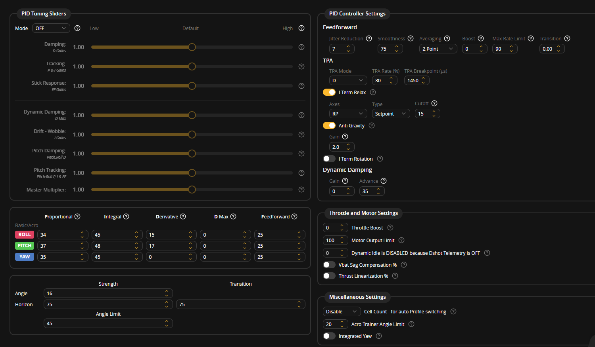

# Test 03: Stable Hover Flight (Wobble Eliminated)

**Date:** October 4, 2026  
**Result:** Passed (Rock-solid attitude stability, wobble completely eliminated)  
**Setup:** Untethered indoor flight  

---

## Why I Did This Test
After Test 02 failed due to violent liftoff wobbling, I went back to the bench and ran several rounds of off-camera tuning and testing. I cleaned up my transmitter and receiver wiring connections, dialed back the control loop aggression, and significantly reworked the PID and angle mode settings. 

The goal for Test 03 was to prove that the wobble was truly gone and achieve our first genuine, controlled indoor hover.

---

## The Whiteboard Breakdown
Here is the whiteboard setup for this milestone flight:

* **Goal:** Achieve Stable Flight
* **Description:** After many off-camera tests and precise tunes, hopefully the wobble is gone
* **Hardware Stack:**
  * Frame: TBS 500 (Clone)
  * FC: DakeFPV F405
  * ESCs: 30A Analog (SimonK/BLHeli)
  * Motors: 4x 2212 1000KV (1045 props)
  * Battery: 3S 2200mAh LiPo
  * Radio: FlySky FS-i6 TX / FS-iA6B RX (i-BUS)
  * GPS: None (yet)
* **Firmware:** Betaflight
* **Tuning:** Custom

---

## The Fine-Tuned PID Preset

Here is the exact profile that finally tamed this 500mm beast:

### What Changed in this Tune:
* **Roll:** P: 34 | I: 45 | D: 15 | D Max: 0 | Feedforward: 25
* **Pitch:** P: 37 | I: 48 | D: 17 | D Max: 0 | Feedforward: 25
* **Yaw:** P: 35 | I: 45 | D: 0 | Feedforward: 25
* **Zeroed Out D Max:** Set D Max completely to 0. Dynamic D-boost was kicking the 10-inch props way too hard on quick movements.
* **Lowered I-Term:** Dropped I down to 45/48 to prevent integral windup from building up on the ground and during liftoff.
* **Massive Angle Mode Downgrade:** Cut Angle Mode strength all the way down from 35 to 16 (originally 50 in stock!). The self-leveling code was previously snapping the heavy frame around way too aggressively. 
* **Angle Mode on VRB Knob:** Mapped Angle Mode to the VRB knob on the FlySky transmitter so I could dial in the self-leveling strength progressively while hovering.
* **Anti-Gravity & Feedforward:** Lowered Anti-Gravity gain to 2.0, killed Feedforward boost to 0, and raised Feedforward smoothness to 75.

---

## What Happened in the Test Video

You can watch the full flight recording here: [Test 03 Video Recording](test_03_stable_hover.mp4)

Here is how the session went:

1. **Liftoff:** Armed smoothly and brought the throttle up steadily. Unlike Test 02, the quad broke ground contact cleanly and climbed into a rock-solid hover.
2. **The Wobble is GONE:** The frame showed zero oscillatory wobble across roll and pitch. The lower P/D gains and zeroed D-Max gave the slow analog ESCs enough breathing room to keep up with the 10-inch props without phase lag.
3. **Multiple Cycles:** Over the course of the flight, I did multiple clean liftoffs, hovered comfortably around knee and waist height, and touched down gently without tipping.
4. **Tuning with the Knob:** Turned the VRB knob to test self-leveling response in Angle mode. The quad leveled itself out gently without any violent snapping or over-correction.
5. **Slow Drift:** The drone drifted slightly across the room during extended hovers. This is completely expected right now because there is no GPS or optical flow sensor mounted yet—it is flying purely on gyros and accelerometers.

---

## What's Next
* **Failsafe Verification:** Run Test 04 to verify in-flight failsafe behavior before moving on to hardware additions.
* **GPS & Compass Installation:** Mount the folding GPS mast and connect the newly arrived M10Q 250 GPS with 5883 compass over UART and I2C.
* **Vibration Isolation Mount:** Remount the DakeFPV F405 flight controller on a cleanly cut credit card base backed with double-sided foam tape to absorb high-frequency motor vibrations from the frame.
* **Custom ArduPilot Build:** Prepare a stripped-down custom ArduPilot binary to fit within the 1MB flash limit of the STM32F405 chip for autonomous navigation.
